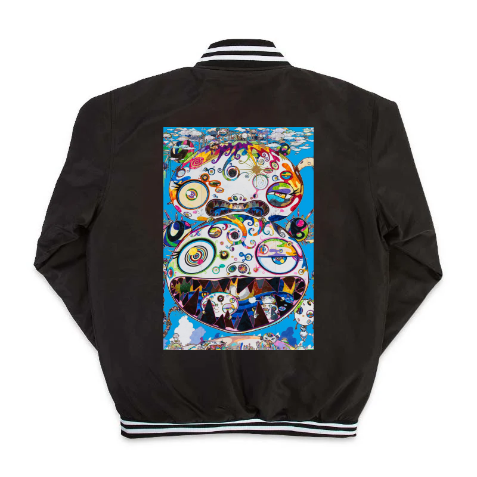
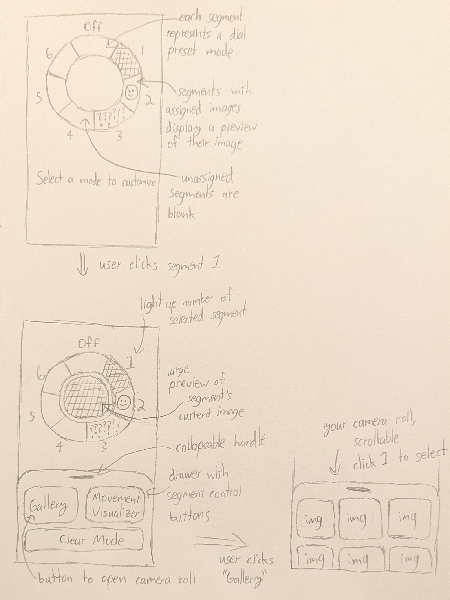
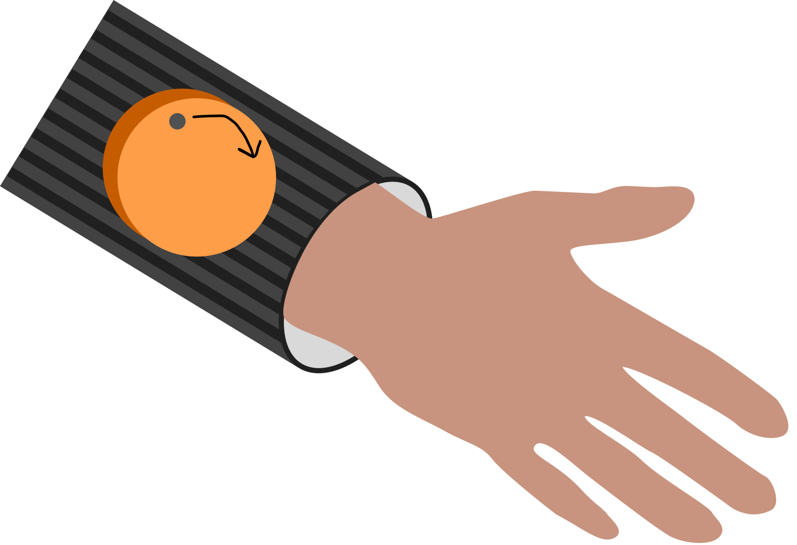
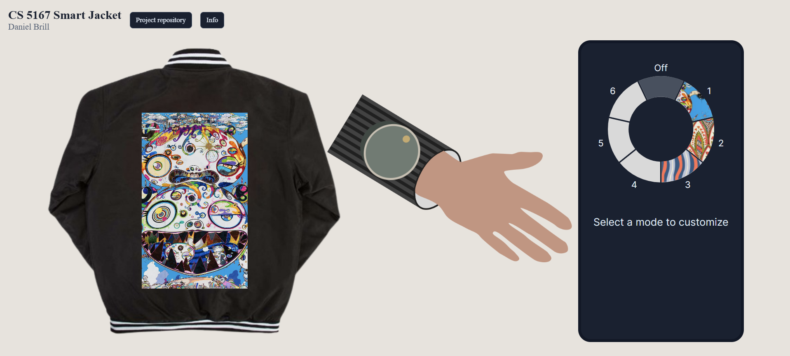
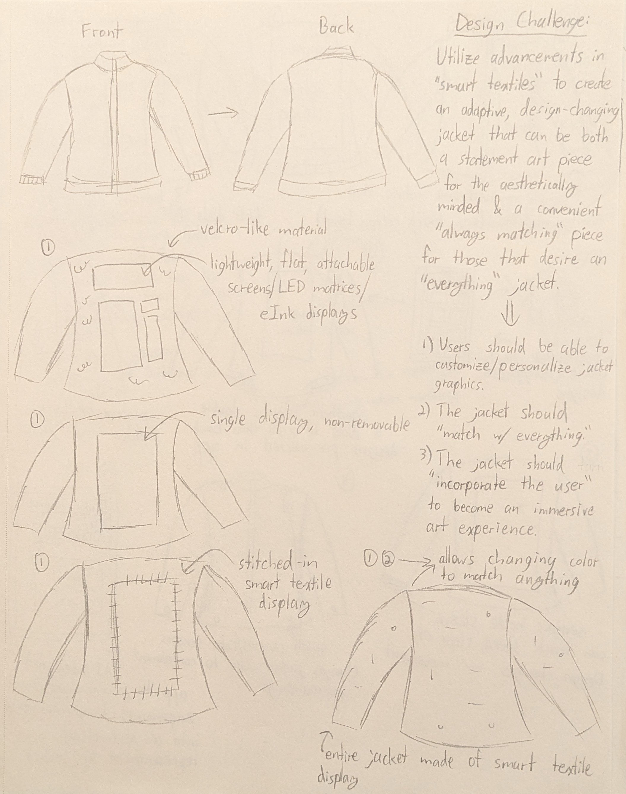
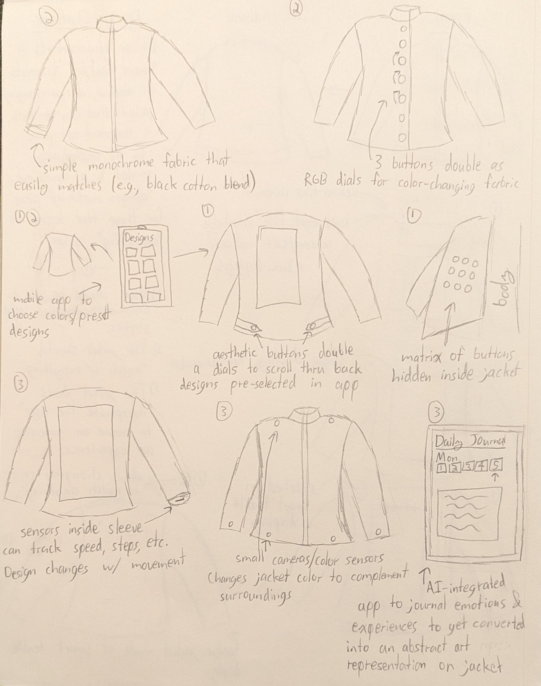
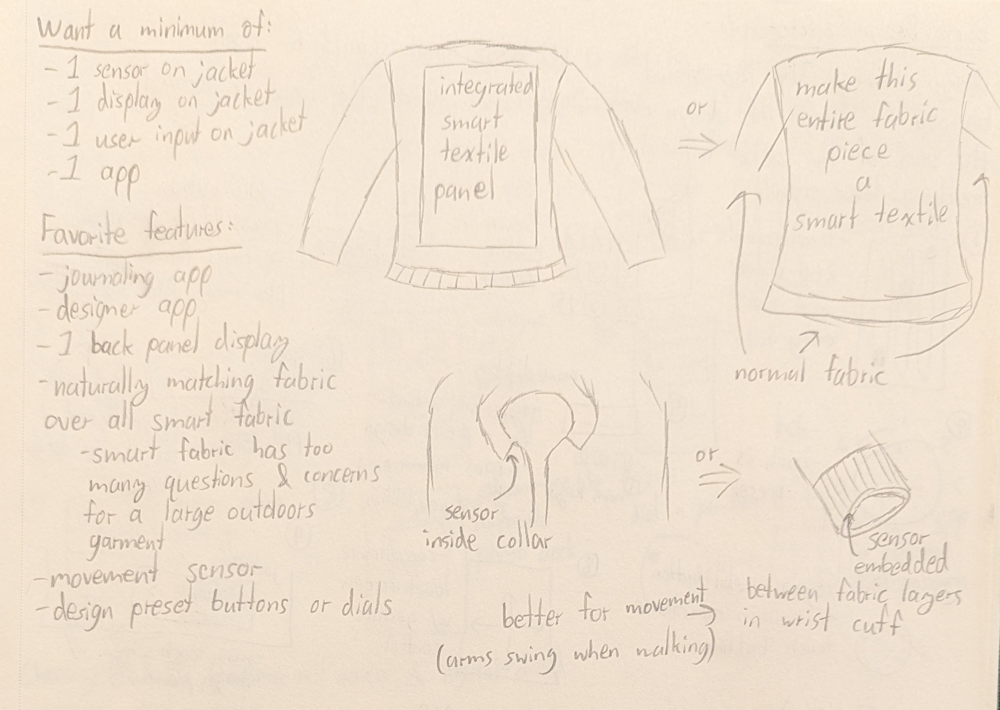
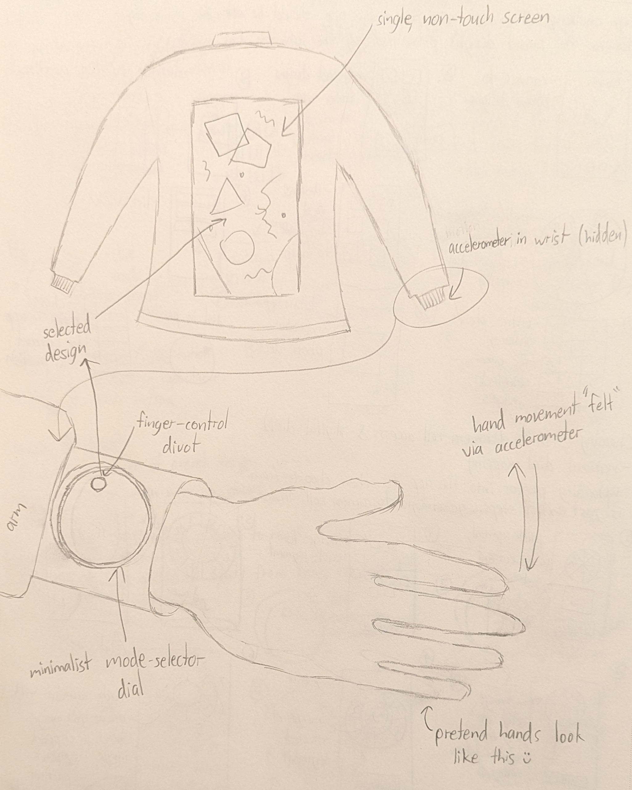

# CS 5167 Smart Jacket

    
    

    
    

    

This project is an interactive art experience built around a hypothetical smart jacket. The jacket uses a customizable smart-textile display on its back, a physical dial on the wrist cuff, and a companion mobile app for configuring the jacket's display modes. The project was created by **Daniel Brill** for CS 5167.

## Table of Contents

- [Try It!](#try-it)
  - [Controls](#controls)
  - [Live Demo](#live-demo)
- [Design](#design)
  - [Project Concept](#project-concept)
  - [Physical Properties and Smart Features](#physical-properties-and-smart-features)
  - [User Needs and Interviews](#user-needs-and-interviews)
  - [Sketching Design Alternatives](#sketching-design-alternatives)
  - [Interface Sketches](#interface-sketches)
- [Interface](#interface)
  - [Jacket Display](#jacket-display)
  - [Wrist Dial](#wrist-dial)
  - [Mobile App](#mobile-app)
  - [Movement Simulation](#movement-simulation)
- [Implementation Details](#implementation-details)
  - [Technology and Structure](#technology-and-structure)
  - [State and Interaction Flow](#state-and-interaction-flow)
- [AI Usage](#ai-usage)
- [Future Improvements](#future-improvements)

## Try It!

The project is hosted publicly on GitHub Pages:

    <a href="https://danielbrill20.github.io/cs5167-smart-jacket/">Open the hosted Smart Jacket application</a>

The source code is available here:

    <a href="https://github.com/DanielBrill20/cs5167-smart-jacket">View the project source on GitHub</a>

### Controls

- **Wrist dial:** Drag around the dial to rotate it between its seven snapped modes. Mode 0 is Off; modes 1-6 control the jacket presets.
- **Mobile app donut:** Select one of the six numbered modes to customize it. The Off segment is not selectable.
- **Gallery:** Choose an image from the phone gallery to assign it to the selected mode.
- **Movement Visualizer:** Assign the movement visualizer to the selected mode.
- **Clear Mode:** Remove the preset assigned to the selected mode.
- **Hand simulation:** Drag the hand across the page. The jacket's movement visualizer responds to the simulated movement.
- **Info:** Open the on-page instructions for the dial, phone, and movement simulation.

## Live Demo

The demo video shows the project components and demonstrates selecting a jacket mode, changing a preset through the mobile app, rotating the wrist dial, and simulating movement with the hand.

## Design

### Project Concept

The Smart Jacket is a regular outdoor jacket with a smart-textile back panel. The panel acts as a customizable display for visual artwork. The physical wrist dial gives the wearer a direct way to switch between presets, while the phone app makes it possible to configure those presets without requiring a complicated control surface on the jacket itself.

The secondary device has a specific role: the phone is the configuration tool, while the jacket remains the wearable display and physical control. This separation keeps the jacket focused on showing the selected artwork and lets the user manage multiple presets from a larger interface.

### Physical Properties and Smart Features

The jacket is a medium-sized, portable, soft wearable object with sleeves and pockets. Its physical affordances, signifiers, assumptions, and proposed smart features are documented in [design/properties.md](design/properties.md).

### User Needs and Interviews

The interview questions, findings, user needs, and design requirements are documented in [design/user_needs.md](design/user_needs.md). The research emphasized convenience, clothing flexibility, avoiding bulky or inconvenient physical features, reducing charging fatigue, and making the jacket useful beyond a short-lived novelty.

These findings informed the design in several ways:

- Customizable artwork lets the jacket adapt to different outfits.
- The phone app provides a convenient way to manage several visual presets.
- The wrist dial gives the wearer a quick physical control.
- The movement visualizer makes the jacket respond to the wearer's activity instead of behaving like a static screen.

### Sketching Design Alternatives

The early alternatives and ten-plus-ten explorations are available in the sketch folder:

    <figure>
        
        <figcaption>Jacket brainstorming</figcaption>
    </figure>
    <figure>
        
        <figcaption>Jacket brainstorming</figcaption>
    </figure>
    <figure>
        
        <figcaption>Jacket brainstorming</figcaption>
    </figure>

Mores targeted alternatives are documented in [the dial ten-plus-ten sketch](design/sketches/dial_ten_plus_ten.jpg) and [the app ten-plus-ten sketch](design/sketches/app_ten_plus_ten.jpg).

### Interface Sketches

The vanilla and hybrid sketches show how the interface moved from an early concept to an integrated object design:

    <figure>
        
        <figcaption>Mobile app vanilla sketch</figcaption>
    </figure>
    <figure>
        
        <figcaption>Jacket vanilla sketch</figcaption>
    </figure>

The final integration is represented by the [jacket hybrid sketch](design/sketches/jacket_hybrid_sketch.png) and [dial hybrid sketch](design/sketches/dial_hybrid_sketch.png).

## Interface

### Jacket Display

The jacket graphic identifies where the UI exists on the physical object. The screen is centered on the back of the jacket and renders the current preset:

- Static image presets fill the textile display.
- The Movement Visualizer renders an animated textile pattern.
- Off changes the display to the dark inactive state.

The screen is output-only. It does not respond directly to pointer input; the dial, phone, and simulated movement control it.

### Wrist Dial

The dial is modeled as a physical, flat cylindrical control on the wrist cuff. It has seven positions:

- Off
- Six numbered preset modes

The digital mockup supports pointer dragging and keyboard arrows. The selected position snaps to the nearest mode, and the dial on the simulated hand shares its selected state with the jacket and phone.

### Mobile App

The phone is a secondary configuration device. Its home screen contains a seven-segment donut corresponding to the physical dial:

- Off is shown at the top and cannot be customized.
- Modes 1-6 can be selected.
- Modes 1-3 begin with image presets.
- Modes 4-6 begin unassigned.
- The selected mode is shown in the center of the donut.

After selecting a mode, the drawer provides Gallery, Movement Visualizer, and Clear Mode actions. Gallery images appear in a scrollable grid, and selecting an image immediately updates the corresponding jacket preset.

### Movement Simulation

The hand image represents the wearer moving their wrist. It can be dragged across the page, and the dial is attached to the wrist so it moves with the hand. The dial remains independently interactive: dragging the hand moves the simulated wrist, while dragging the dial changes the selected mode.

When a mode is assigned to Movement Visualizer, hand movement creates animated contours, fibers, and disturbance waves on the jacket screen.

## Implementation Details

### Technology and Structure

The application is implemented with HTML, CSS, JavaScript, and Svelte:

- `App.svelte` owns shared preset, dial, and movement state.
- `MobileApp.svelte` renders the phone configuration interface and gallery.
- `Dial.svelte` renders the physical dial and its snapped interaction.
- `MovementVisualizer.svelte` renders the draggable hand and the dial mounted on its wrist.
- `Screen.svelte` renders static artwork and the canvas-based movement visualizer.
- `app.css` defines the page-level layout and visual background.

The production build is configured with Vite and deployed through GitHub Actions to GitHub Pages.

### State and Interaction Flow

The app uses shared Svelte state so each control surface stays synchronized:

1. The wrist dial changes `selectedMode`.
2. The mobile app changes the preset assigned to that mode.
3. The screen reads the selected mode and preset and renders the corresponding output.
4. The hand simulation sends movement position, speed, and direction to the visualizer.
5. The movement canvas uses those values to create directional waves and textile-like motion.

## AI Usage

AI was used throughout development as a coding assistant and iteration partner. It helped with component scaffolding, Svelte state wiring, CSS layout adjustments, SVG interaction layers, canvas visualizer logic, responsive behavior, and GitHub Pages configuration.

The implementation was reviewed and repeatedly adjusted manually to match the intended design. In particular, the dial appearance, label placement, jacket/screen composition, hand interaction, mobile drawer behavior, gallery ordering, and color palette were refined through direct testing and feedback. AI did not replace the design process or user research; the sketches and user-needs documentation represent the design work that guided the implementation.

## Future Improvements

The current prototype demonstrates the core interaction, but several parts could be developed further:

- Connect the interface to real smart-textile hardware.
- Replace the simulated wrist movement with a physical motion sensor.
- Add persistent storage so preset assignments survive a page refresh.
- Support user-uploaded artwork instead of only the provided gallery assets.
- Spotify integration to render album art as a digital CD.
